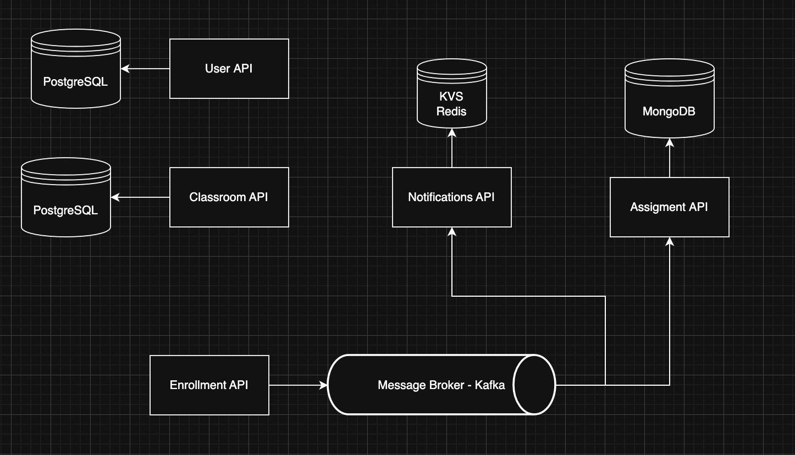
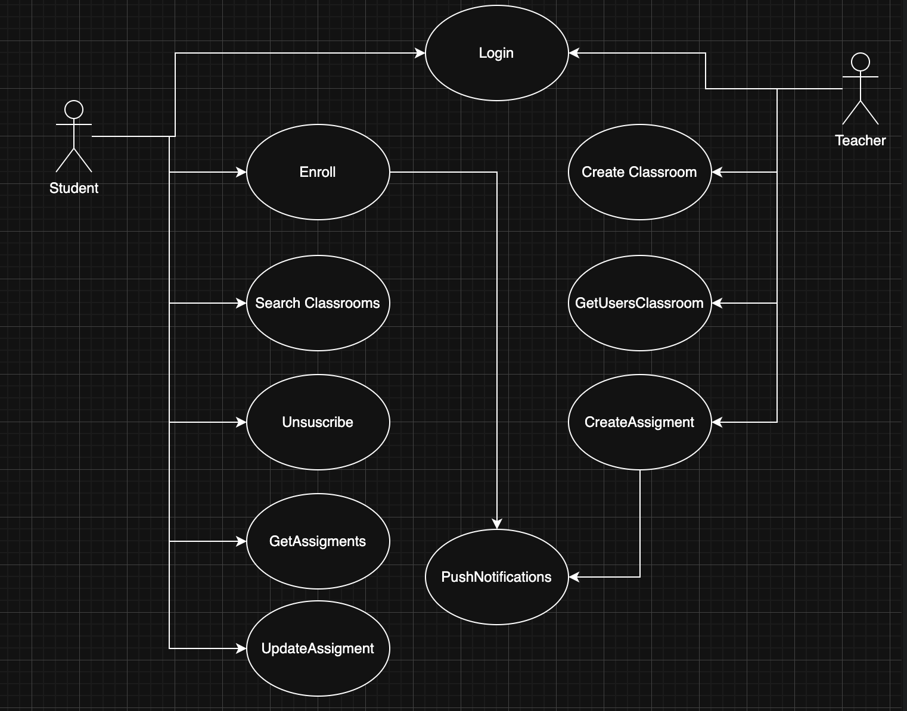

### CLASSROOM MICROSERVICE

## Tech

- Go
- PostgreSQL
- Mongo
- Kafka
- Redis
- Docker

### Users API
    Handle CRUD operations of User with a relational DB in PostgreSQL and implement Loging System with JTWT.

### Classroom API
    Handle CRUD operations of Classrooms a relational DB in PostgreSQL.
    
### Assigment API
    Handle CRUD operations for te assigments of a classroom that Users must complete. The assigments and student task are stored in a no-relational MongoDB.

### Enrollment API
    Message Broker developed using Kafka, sending messages to a enrollment topic to be consumed for Assigment API and Notifications API when a user is enrolled to a Classroom.

### Notifications API
    KVS developed using Redis to store the notifications sended to Users.

## Arquitecture
### Microservices

### Actor Actions

## Swagger o Postman Curls

## How to use in Docker

## TODO
 - Tests
 - Frontend
 - Complete Readme